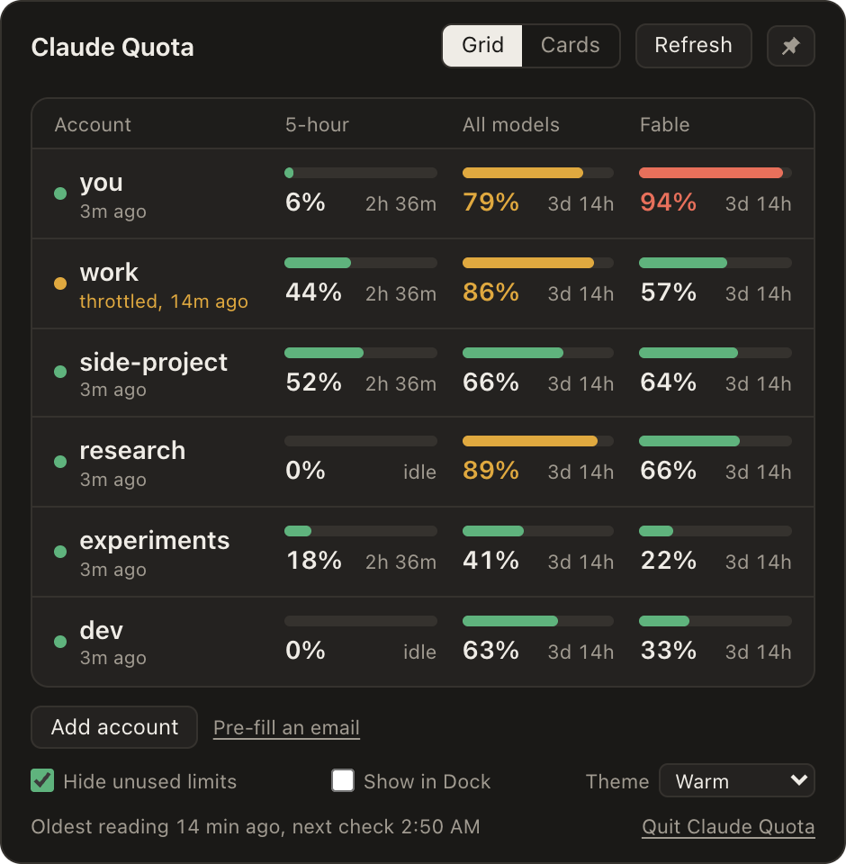
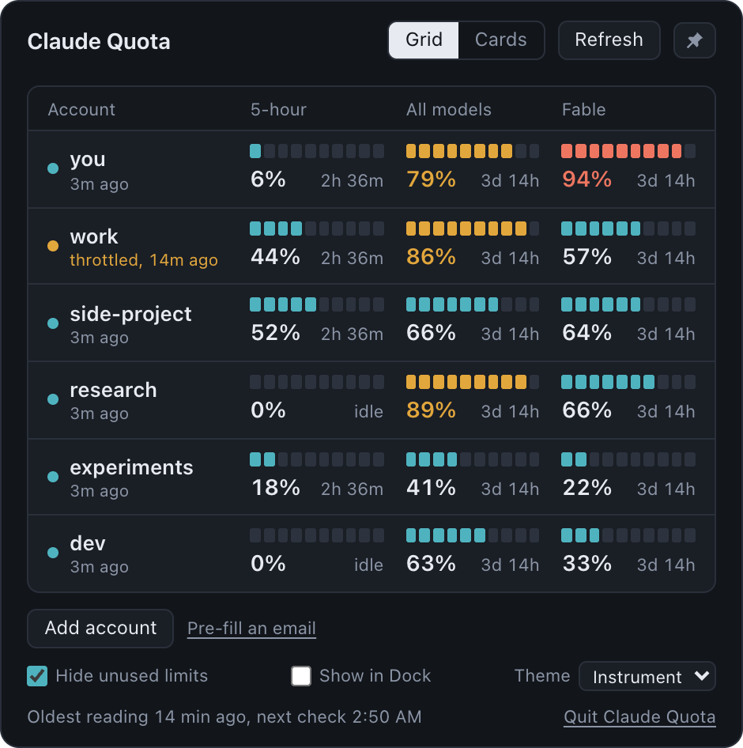
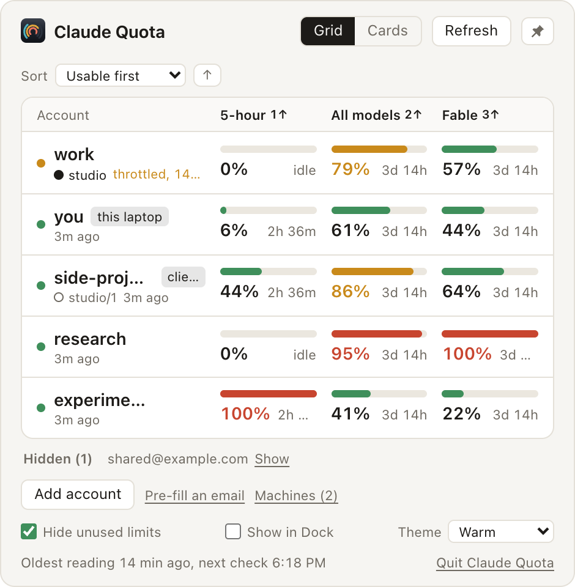
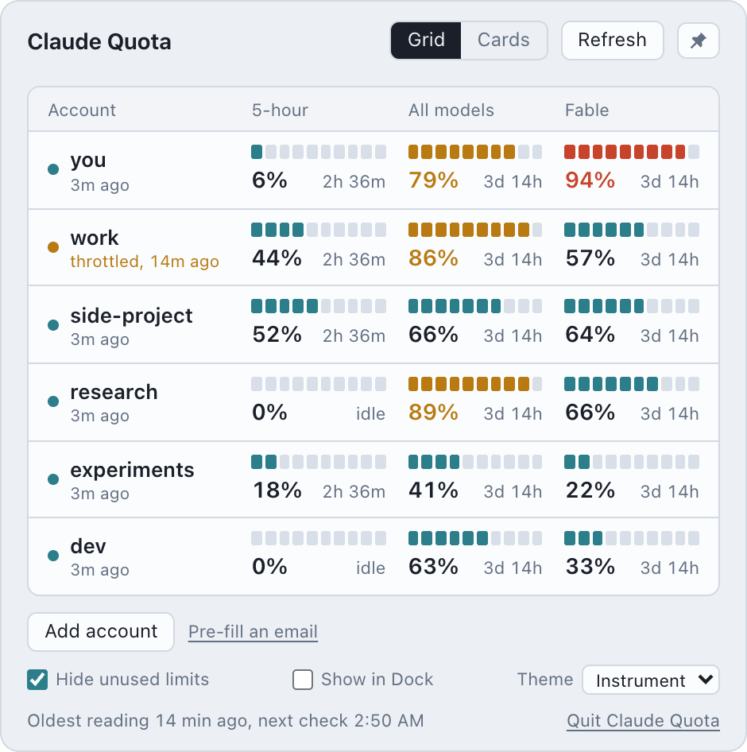

# Claude Quota

A small macOS (Tauri) app that shows the usage limits of multiple Claude accounts at once.

Claude Code only keeps one login active at a time, so checking how much quota is left on your other accounts means logging out and back in or keeping multiple Chrome profile tabs with each account open showing the Usage page. This app keeps a separate login for each account and shows all of them at once.

| Warm theme | Instrument theme |
|---|---|
|  |  |

Both themes follow the system appearance. In light mode:

| Warm theme | Instrument theme |
|---|---|
|  |  |

The screenshots use made-up accounts.

## Install

1. Download the latest `.dmg` from [Releases](https://github.com/samzhao/claude-quota-widget/releases/latest) (Apple Silicon Macs).
2. Open it and drag **Claude Quota** into Applications.
3. The first time you open it, macOS will say it could not verify the app. That is expected: the app is not signed with a paid Apple Developer ID. Go to **System Settings → Privacy & Security**, scroll down, and click **Open Anyway**. You only do this once.

If you prefer the terminal, this clears the download flag instead of step 3:

```sh
xattr -dr com.apple.quarantine "/Applications/Claude Quota.app"
```

You need [Claude Code](https://claude.com/claude-code) installed, because the app uses its `claude` command to sign accounts in. Or skip the download and [build it from source](#run-it).

The app lives in the menubar: click the gauge to open it, press Esc to hide it.

## What it does

- Adds an account by running the official `claude auth login` in a throwaway config folder. Your browser opens, you sign in, and the row appears. No email or API key to type.
- Shows all accounts at once in a grid (accounts down, limits across) or as cards and require no switching.
- Shows when each limit resets, how old each reading is, and a badge when a check failed and why.
- Shows the default authed Claude Code already as a read-only row.
- Renews its own logins before they expire, so accounts stay connected.

## How it works

- **Logins** are made by the official Claude Code CLI. The app copies the resulting tokens into its own macOS keychain entries (service name `Claude Quota Widget`) and deletes the temporary folder and keychain item the CLI created. Tokens stay in the keychain and in the Rust process. The web UI only ever receives labels and percentages.
- **Claude Code's own login is never modified.** The app reads it to show the read-only row. It never writes, renews or deletes it.
- **Usage numbers** come from Anthropic's OAuth usage endpoint, called with each account's own login. That endpoint throttles quickly, so readings are cached on disk and reused for 5 minutes, `Retry-After` is honored, and repeated throttling backs off for up to 30 minutes. The last good reading stays on screen in the meantime.

## Requirements

- macOS
- [Claude Code](https://claude.com/claude-code) installed, so the `claude` command exists
- To build: current stable Rust, Node 22+, pnpm

## Run it

```sh
pnpm install
pnpm tauri dev     # development
./scripts/build-release.sh   # signed .app and .dmg, without your home path baked into the binary
```

Tests: `cd src-tauri && cargo test`. Tests that touch the real keychain or network are marked `#[ignore]` and only run when asked for.

## Disclaimer

This is an unofficial personal project. It is not affiliated with, endorsed by, or supported by Anthropic.

- It is meant for one person viewing the usage of **their own** accounts. It does not share, pool, or resell accounts, and it does not route any model requests. It never sends a prompt. It only reads usage numbers.
- It relies on undocumented endpoints and the public OAuth client id used by Claude Code. These are not a supported API. They can change or stop working at any time, and this app may break without notice.
- You are responsible for making sure your use complies with Anthropic's [Consumer Terms](https://www.anthropic.com/legal/consumer-terms) and [Usage Policy](https://www.anthropic.com/legal/aup), including any rules about how many accounts you may hold. If you are unsure, do not use it.
- Provided as is, with no warranty. If Anthropic asks for this project to be changed or taken down, it will be.

## License

[MIT](LICENSE)
