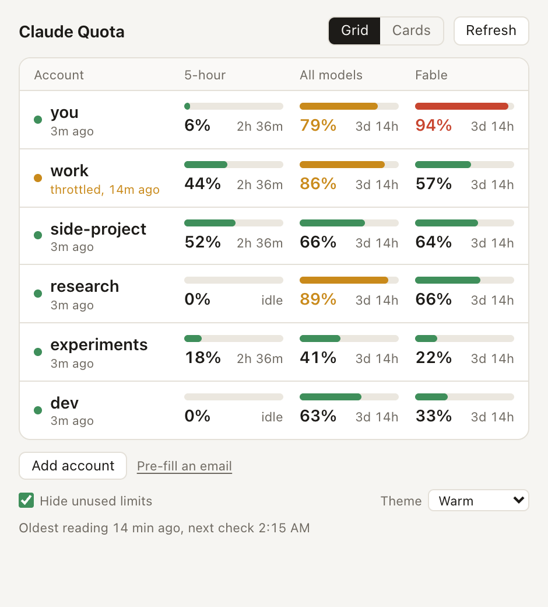
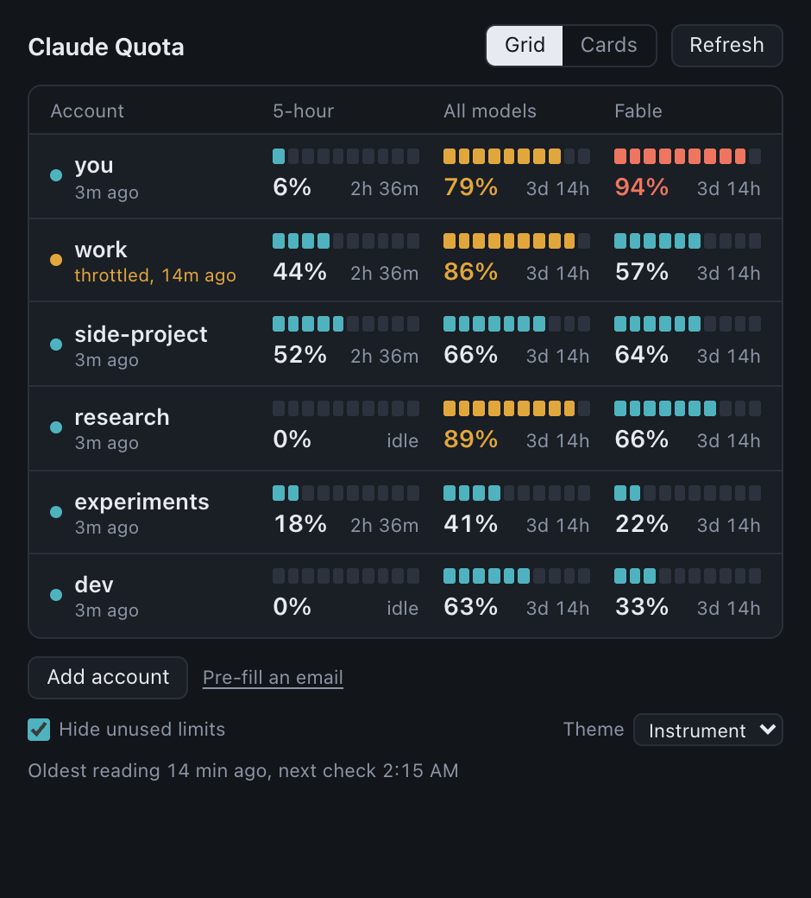
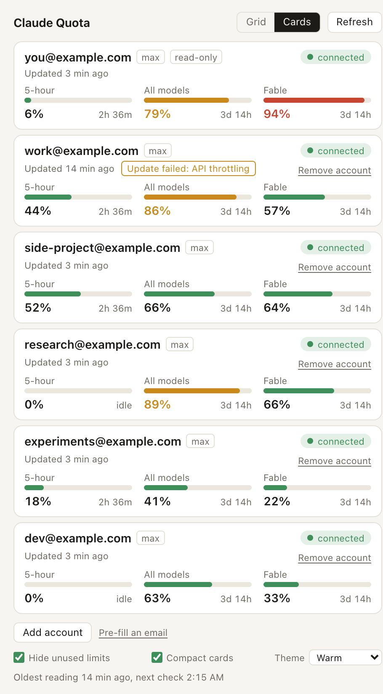

# Claude Quota

A small macOS app that shows the usage limits of several Claude accounts side by side.

Claude Code only keeps one login active at a time, so checking how much quota is left on your other accounts means logging out and back in. This app keeps a separate login for each account and shows all of them at once: the 5-hour session limit, the weekly all-models limit, and per-model limits such as Fable.

| Warm theme | Instrument theme |
|---|---|
|  |  |

There is also a Cards view with an optional compact layout:



The screenshots use made-up accounts.

## What it does

- Adds an account by running the official `claude auth login` in a throwaway config folder. Your browser opens, you sign in, and the row appears. No email or API key to type.
- Shows every account at once in a grid (accounts down, limits across) or as cards.
- Shows when each limit resets, how old each reading is, and a badge when a check failed and why.
- Shows the login Claude Code already uses on this Mac as a read-only row.
- Renews its own logins before they expire, so accounts stay connected.

## How it works

- **Logins** are made by the official Claude Code CLI. The app copies the resulting tokens into its own macOS keychain entries (service name `Claude Quota Widget`) and deletes the temporary folder and keychain item the CLI created. Tokens stay in the keychain and in the Rust process. The web UI only ever receives labels and percentages.
- **Claude Code's own login is never modified.** The app reads it to show the read-only row. It never writes, renews or deletes it.
- **Usage numbers** come from Anthropic's OAuth usage endpoint, called with each account's own login. That endpoint throttles quickly, so readings are cached on disk and reused for 5 minutes, `Retry-After` is honored, and repeated throttling backs off for up to 30 minutes. The last good reading stays on screen in the meantime.

## Requirements

- macOS
- [Claude Code](https://claude.com/claude-code) installed, so the `claude` command exists
- To build: current stable Rust, Node 22+, pnpm

## Run it

```sh
pnpm install
pnpm tauri dev     # development
pnpm tauri build   # produces a .app bundle
```

Tests: `cd src-tauri && cargo test`. Tests that touch the real keychain or network are marked `#[ignore]` and only run when asked for.

## Disclaimer

This is an unofficial personal project. It is not affiliated with, endorsed by, or supported by Anthropic.

- It is meant for one person viewing the usage of **their own** accounts. It does not share, pool, or resell accounts, and it does not route any model requests. It never sends a prompt. It only reads usage numbers.
- It relies on undocumented endpoints and the public OAuth client id used by Claude Code. These are not a supported API. They can change or stop working at any time, and this app may break without notice.
- You are responsible for making sure your use complies with Anthropic's [Consumer Terms](https://www.anthropic.com/legal/consumer-terms) and [Usage Policy](https://www.anthropic.com/legal/aup), including any rules about how many accounts you may hold. If you are unsure, do not use it.
- Provided as is, with no warranty. If Anthropic asks for this project to be changed or taken down, it will be.
